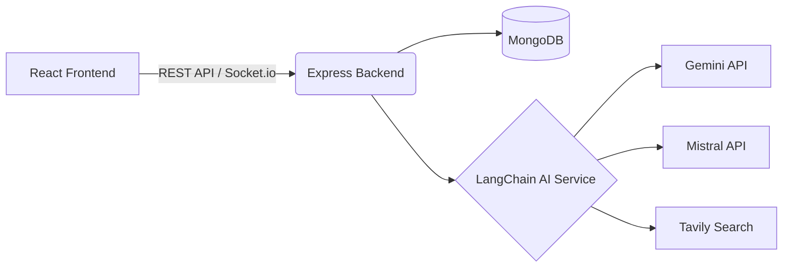

# Axion AI: Deep Dive Documentation

Axion AI is a real-time conversational AI platform featuring a robust React frontend and an Express/Node.js backend. It leverages LangChain to integrate multiple LLMs (Gemini, Mistral) and provides internet search capabilities via Tavily, all wrapped in a sleek, modern UI.

This README serves as an exhaustive guide to the repository, explaining the precise role and rationale behind every component, configuration, and architectural decision.


## Table of Contents
- [Quick Start](#quick-start)
- [Architectural Deep Dive](#architectural-deep-dive)
- [Backend Mechanics](#backend-mechanics)
  - [Entry Point & Server Setup](#1-entry-point--server-setup)
  - [Authentication Flow](#2-authentication-flow)
  - [AI Orchestration (LangChain)](#3-ai-orchestration-langchain)
  - [Chat & Message Management](#4-chat--message-management)
  - [Data Models](#5-data-models)
  - [Realtime Connectivity](#6-realtime-connectivity)
- [Frontend Mechanics](#frontend-mechanics)
  - [State Management (Redux)](#1-state-management-redux-toolkit)
  - [Custom Hooks](#2-custom-hooks)
  - [The Dashboard UI](#3-the-dashboard-ui-dashboardjsx)
- [Installation and Setup](#installation-and-setup)
- [Configuration](#configuration)
- [API Reference & Usage Examples](#api-reference--usage-examples)

---

## Quick Start
Get a minimal example running locally:

```bash
# Terminal 1 - Backend
cd backend
npm install
cp .env.example .env # Ensure you fill out GEMINI_API_KEY, JWT_SECRET, etc.
npm run dev

# Terminal 2 - Frontend
cd frontend
npm install
npm run dev
```
Open `http://localhost:5173` in your browser.

---

## Architectural Deep Dive
Axion AI uses a decoupled client-server architecture:
- **Frontend:** Built with Vite and React. Vite was chosen for its extremely fast HMR (Hot Module Replacement) and optimized build process. State is managed via Redux Toolkit to provide predictable global state updates, particularly useful for managing complex, deeply nested chat histories.
- **Backend:** Node.js with Express provides a lightweight, highly customizable web server. MongoDB (via Mongoose) is used for its schema flexibility, which is ideal for storing unstructured AI chat messages. LangChain acts as the middleware orchestrator for LLMs, abstracting away provider-specific API idiosyncrasies.



---

## Backend Mechanics

### 1. Entry Point & Server Setup
**Files: `server.js` & `src/app.js`**

- **`server.js`:** This is the execution entry point. It initializes the MongoDB connection and binds the Express app to an HTTP server wrapper. The HTTP wrapper is strictly necessary because `socket.io` requires a raw Node HTTP server instance to attach its WebSocket upgrade listeners. It includes an error listener for `EADDRINUSE` to gracefully handle port collisions.
- **`app.js`:** This file defines the Express middleware pipeline. 
  - `cors` is configured strictly to allow `http://localhost:5173` and `credentials: true`, which is required for the browser to send the HTTP-only JWT cookies during API calls.
  - `cookie-parser` is utilized to parse the incoming `Cookie` header into a readable `req.cookies` object.
  - `morgan("dev")` provides color-coded, concise HTTP request logging.

### 2. Authentication Flow
**Files: `auth.controller.js`, `auth.router.js`, `auth.middleware.js`**

Security is paramount, so the auth flow relies on HTTP-only cookies to store JWTs, immunizing the application against XSS (Cross-Site Scripting) attacks that might steal tokens from `localStorage`.

- **Registration (`register`):** 
  Takes a username, email, and password. It checks for uniqueness against the database. Upon creation, it generates an email verification JWT (`emailVerificationToken`) and dispatches a welcome email with a verification link using NodeMailer (`mail.service.js`). The user cannot log in until this link is clicked.
- **Verification (`verifyEmail`):** 
  An endpoint designed to be clicked from an email client. It decodes the token from the query parameters, finds the user, flips the `verified` boolean to `true`, and returns an HTML response that the user's browser renders directly, prompting them to navigate to the login page.
- **Login (`login`):** 
  Validates the email and password. If the user is unverified, it blocks the login. If successful, it generates a session JWT (valid for 7 days) and injects it into an HTTP-only, `lax` same-site cookie. 
- **Middleware (`authUser`):** 
  Protects private routes. It reads `req.cookies.token`, verifies its signature with `JWT_SECRET`, and attaches the decoded payload (containing the user ID) to `req.user`.

### 3. AI Orchestration (LangChain)
**File: `ai.service.js`**

This is the brain of the backend, utilizing LangChain to build an agentic workflow.

- **`generateResponse`:** 
  Converts standard JSON messages `{ role, content }` into LangChain's specific `HumanMessage`, `SystemMessage`, and `AIMessage` classes. It uses `createReactAgent`, initializing a ReAct (Reasoning and Acting) loop. This gives the Gemini model (Google GenAI) a scratchpad to think step-by-step and decide whether to utilize the injected `searchInternet` tool (Tavily). The agent returns the final message when it concludes its reasoning.
- **`generateChatTitle`:** 
  Whenever a new chat is initiated, this function is called asynchronously to give the chat a meaningful name. It attempts to use the Mistral AI model first, as Mistral is often optimized for fast, concise summarizations. If Mistral fails (or the API key is missing/invalid), it features a graceful degradation mechanism: falling back to Gemini, and if Gemini fails, it simply splits the user's message and takes the first 5 words.

### 4. Chat & Message Management
**File: `chat.controller.js`**

- **`sendMessage`:** 
  The core endpoint for chat interaction. If `chatId` is not provided (indicating a brand new chat), it generates a title (via `generateChatTitle`) and creates a new Chat record in the DB. It saves the user's message, retrieves *all* previous messages for that specific `chatId` to maintain conversational context, and passes the entire array to `generateResponse`. Finally, it saves the AI's response and sends the payload back to the client.
- **`getMessages` / `getChats`:** 
  Standard GET endpoints scoped to `req.user.id` to ensure users can only fetch their own chat histories.

### 5. Data Models
**Files: `user.model.js`, `chat.model.js`, `message.model.js`**

- **User Model:** Contains `username`, `email`, `password`, and `verified` fields. Pre-save hooks (usually utilized here) hash the password using `bcrypt` before storing it in MongoDB.
- **Chat Model:** A lightweight model linking a `user` ObjectId to a `title`.
- **Message Model:** Links to a `chat` ObjectId. Stores the `content` (String) and `role` (Enum: "user" | "ai"). By decoupling messages from the Chat document, the DB avoids the 16MB MongoDB document size limit that would occur if messages were embedded in an array inside the Chat model.

### 6. Realtime Connectivity
**File: `server.socket.js`**

Initializes a Socket.io server with CORS configured for the frontend. While currently acting as a scaffold (logging "A user connected"), this is intentionally included to allow future features like real-time typing indicators, streaming AI responses token-by-token, or multi-device synchronization without HTTP polling overhead.

---

## Frontend Mechanics

### 1. State Management (Redux Toolkit)
**Files: `app.store.js`, `chat.slice.js`**

Redux is used over simple React Context because chat applications require frequent, deeply nested state updates (e.g., appending a message to a specific chat array).
- **`chat.slice.js`:** The state maintains a `chats` dictionary (Object) rather than an array. This is a critical performance optimization: looking up, updating, or appending messages to `state.chats[chatId]` is an `O(1)` operation. It tracks global `isLoading` states to disable inputs system-wide when the AI is "thinking".

### 2. Custom Hooks
**File: `useChat.js`**

React components should ideally be presentation layers. The `useChat` hook acts as a ViewModel, bridging the UI and the network layer. 
- **`handleSendMessage`:** Orchestrates a complex sequence: it dispatches an optimistic UI update (adding the user message to Redux immediately), makes the API call to the backend, and upon receiving the response, dispatches the AI's message and updates the `currentChatId`. If an error occurs, it catches it and dispatches an error state to be rendered.
- **`handleOpenChat`:** Checks if the requested chat's messages are already in Redux. If they are, it avoids a redundant network request. If not, it fetches them and populates the store.

### 3. The Dashboard UI (`DashBoard.jsx`)
**File: `frontend/src/features/chat/pages/DashBoard.jsx`**

The `DashBoard` component serves as the primary visual interface of the application, orchestrating local component state, global Redux state, and complex UI rendering logic.

- **Component & Global State Mapping:** 
  - It utilizes Redux's `useSelector` to subscribe to the global `chats` dictionary, the `currentChatId`, and loading boolean flags (`isLoading`, `isChatsLoading`). This ensures the UI instantly reacts to network states.
  - The `useAuth` hook is imported to access user data (for rendering the profile badge) and the `handleLogout` function for session termination.
  - Local state `chatInput` manages the controlled text input form.
- **Custom Hooks Integration:** 
  - By instantiating `useChat()`, the component accesses all complex asynchronous behaviors (`chat.handleSendMessage`, `chat.handleOpenChat`, etc.) without bloating the component itself with `fetch` or `axios` calls.
- **Lifecycle & Initialization:**
  - Upon mounting (`useEffect` with empty dependency array), it immediately calls `chat.initializeSocketConnection()` to establish the WebSocket link and `chat.handleGetChats()` to fetch the historical list of chats for the sidebar.
- **Responsive Layout Mechanics:** 
  - A dedicated `useEffect` sets up a window resize event listener. If the viewport width drops below 768px, `isSidebarOpen` is set to `false`, collapsing the sidebar into a mobile-friendly hamburger menu overlay. Tailwind CSS manages the transition animations (`translate-x-full` vs `translate-x-0`).
- **Render Flow & Conditional Views:**
  - **The Sidebar:** Iterates over the `chats` object. If `isChatsLoading` is true, it renders pulsing skeleton placeholders. It includes a "New Chat" button that resets `currentChatId` to `null`.
  - **Empty State (Welcome Screen):** If there is no active chat or the active chat has zero messages, it renders a visually distinct welcome screen featuring quick-start suggestions (e.g., "write a cover letter for a job"). Clicking a suggestion directly triggers `chat.handleSendMessage`.
  - **Active Chat View:** When messages exist, it maps through the array. User messages are styled with a solid blue background aligned right, while AI messages are transparent and aligned left.
- **Rich Text & Code Rendering:** 
  - AI responses are parsed through `ReactMarkdown`. Plugins like `remarkGfm` enable rendering of tables, checkboxes, and strikethroughs.
  - The component overrides default markdown rendering via the `components={{...}}` prop. Most notably, it intercepts `code` blocks. If a code block specifies a language (like ` ```javascript `), it wraps it in a `SyntaxHighlighter` component using the `vscDarkPlus` theme, creating an IDE-like reading experience complete with custom paddings and borders. Inline code is rendered with distinct background and text colors to differentiate it from plain text.

---

## Installation and Setup

### Prerequisites
- Node.js (v18+)
- MongoDB instance (local or Atlas)
- API Keys: Gemini, Mistral (optional), Tavily (optional)

### Backend Setup
```bash
cd backend
npm install
npm run dev
```

### Frontend Setup
```bash
cd frontend
npm install
npm run dev
```

---

## Configuration
The backend requires environment variables defined in `backend/.env`.

| Variable | Type | Default | Description |
|---|---|---|---|
| `PORT` | Number | 8000 | Port for the backend server |
| `MONGO_URI` | String | None | MongoDB connection string |
| `JWT_SECRET` | String | None | Secret for signing auth tokens |
| `GEMINI_API_KEY` | String | None | Required for core AI reasoning |
| `MISTRAL_API_KEY` | String | None | Used for optimized chat title generation |

---

## API Reference & Usage Examples

### Authentication (`/api/auth`)

**Register a User**
```bash
curl -X POST http://localhost:8000/api/auth/register \
  -H "Content-Type: application/json" \
  -d '{"username": "testuser", "email": "test@test.com", "password": "password123"}'
```
*Expected Output (201 Created):*
```json
{
  "message": "User registered successfully",
  "success": true,
  "user": { "id": "...", "username": "testuser", "email": "test@test.com" }
}
```

**Login**
*Note: Returns a JWT in an HTTP-only cookie.*
```bash
curl -X POST http://localhost:8000/api/auth/login \
  -H "Content-Type: application/json" \
  -d '{"email": "test@test.com", "password": "password123"}'
```

### Chat (`/api/chats`)

**Send a Message**
```bash
curl -X POST http://localhost:8000/api/chats \
  -H "Cookie: token=<your_jwt_token>" \
  -H "Content-Type: application/json" \
  -d '{"message": "What is the capital of France?", "chatId": "optional_chat_id"}'
```
*Expected Output (201 Created):*
```json
{
  "title": "Capital of France", 
  "chat": { "_id": "...", "title": "Capital of France", "user": "..." },
  "aiMessage": { "content": "The capital of France is Paris.", "role": "ai" }
}
```
